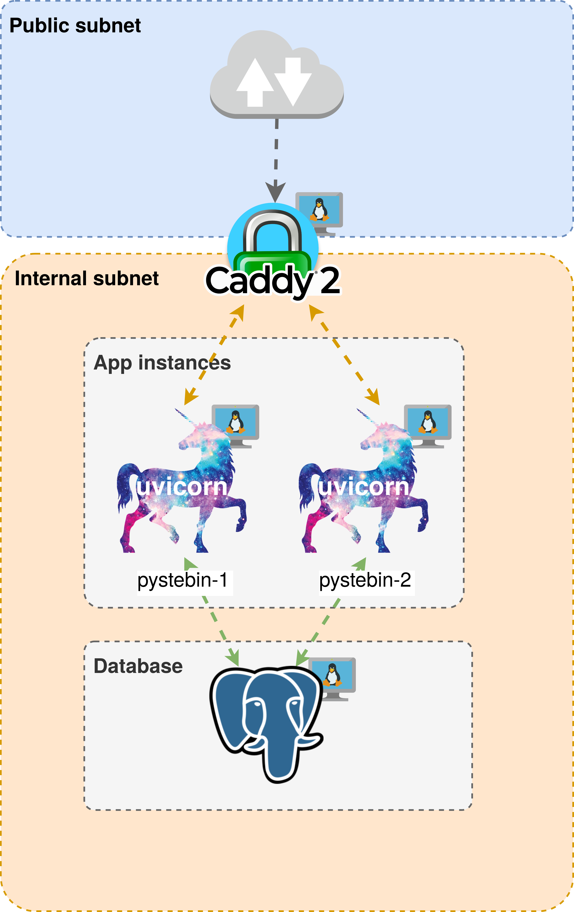
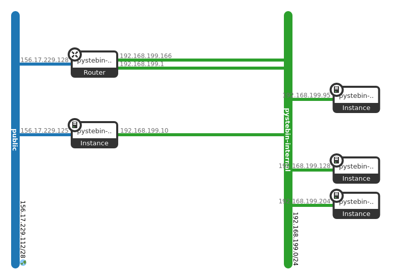

\newpage

# Opis Aplikacji

Pystebin czyli prosta aplikacja typu pastebin napisana w Pythonie z użyciem modułu asyncio.
najważniejsze funkcje jakie posiada:

- Logowanie i autoryzację z wykorzystaniem GitHub OAuth
- Zapisywanie podanych przez użytkownika dokumentów w bazie danych
- Wgląd do zapisanych dokumentów przez wszystkich użytkowników


link: https://pystebin.duckdns.org

## Uvicorn

Web Serwer ASGI jednego z nowszych protokołów. Wykorzystywany do pisania aplikacji webowych z wykorzystaniem języka Python w trybie async.

## FastAPI

Nowy bardzo przyjazny Developerom framework do pisania aplikacji webowych, łączy biblioteki Starlette (Web Framework niższego poziomu) oraz Pydantic (walidacja oraz statyczne typowanie w Pythonie)

    link: https://fastapi.tiangolo.com/

### Pydantic
Moduł do Pythona napisany w ruscie wykorzystywany do tworzenia obiektów o znanej i ściśłej strukturze.

    link: https://pydantic.dev/
  
### Psycopg
Moduł pozwalający łączyć się z bazą danych PostgreSQL oraz implementujący input sanitization.

    link https://www.psycopg.org/

### Jinja2
Templating library - moduł pozwalający tworzyć szablony wykorzystywany do generowania statycznych stron w aplikacji, posiada również umiejętnośćkodowania znaków HTML (HTML escaping)

    link: https://jinja.palletsprojects.com/

\newpage

# Load balancer - Caddy

Bardzo prosty w obsłudze serwer webowy z automatycznym wbudowanym pozyskiwaniem certyfikatów TLS.

Load balancing możliwy w jedną linijkę: `reverse_proxy app1:port app2:port`

Pozyskiwanie certyfikatów możliwe w 0: ` `

## Konfiguracja

Konfiguracji Caddy jest wykonana przy pomocy pliku `/etc/caddy/Caddyfile` definiuje on serwer dla domeny "pystebin.duckdns.org". 
Wyjaśnienie poszczególnych elementów konfiguracji:

1. **header {...}**: To blok ustawień nagłówków HTTP. Definiuje różne nagłówki bezpieczeństwa i polityki dla przeglądarek internetowych. Oto krótkie wyjaśnienie każdego z ustawień:
    - **Referrer-Policy no-referrer-when-downgrade**: Określa, jak przeglądarka powinna przesyłać informacje o odwołaniach. W tym przypadku mówi, aby nie przesyłała informacji o odwołaniach, jeśli protokół odwołania jest mniej bezpieczny (np. z HTTPS na HTTP).   
    - **Strict-Transport-Security "max-age=31536000; includeSubDomains; preload"**: Włącza mechanizm HSTS (HTTP Strict Transport Security), który zobowiązuje przeglądarkę do korzystania z protokołu HTTPS zamiast HTTP, nawet jeśli użytkownik spróbował otworzyć stronę za pomocą HTTP. Parametr "max-age" określa, jak długo reguła HSTS będzie obowiązywać (w sekundach), "includeSubDomains" obejmuje wszystkie subdomeny, a "preload" oznacza, że strona może zostać dodana do listy preload HSTS. 
    - **X-Xss-Protection "1; mode=block"**: Włącza mechanizm ochrony przed atakami typu XSS (Cross-Site Scripting) w przeglądarkach. Jeśli wykryje próbę ataku XSS, blokuje wykonanie skryptu.
    - **X-Content-Type-Options "nosniff"**: Zapobiega przeglądarkom interpretacji plików w sposób niezgodny z ich typem MIME. W praktyce uniemożliwia przeglądarce "sniffowanie" typu MIME.
    - **X-Frame-Options "DENY"**: Zapobiega atakom clickjacking poprzez uniemożliwienie umieszczania strony w ramkach (`<frame>`, `<iframe>`).
    - **Content-Security-Policy "upgrade-insecure-requests"**: Wymusza, aby wszystkie zasoby były pobierane przez bezpieczne połączenia (HTTPS), nawet jeśli na stronie znajdują się linki do niezabezpieczonych zasobów.
2. **reverse_proxy \${app_hosts}**: Reverse proxy to serwer pośredniczący między klientem, a jednym lub wieloma serwerami docelowymi. W przeciwieństwie do tradycyjnego (forward) proxy, który obsługuje ruch klienta do Internetu, reverse proxy kieruje ruch z klienta do serwera docelowego. Parametr `${app_hosts}` jest zmienną, która zawiera adresy hostów aplikacji, do których Caddy przekieruje ruch. 

 Ta konfiguracja Caddy ma na celu zabezpieczenie witryny poprzez korzystanie z różnych nagłówków bezpieczeństwa i wymuszenie korzystania z protokołu HTTPS. Caddy automatycznie pobiera i aktualizuje certyfikaty z "Let’s Encrypt"  Ponadto, ustanawia ona reverse proxy dla aplikacji, którą obsługuje, przekierowując ruch do określonych hostów aplikacji. Przy podaniu większej ilości hostów caddy, służy jako load balancer. Opcje load balancer pozostawiono na jako domyślną czyli `lb_policy=random`. 

    link: https://caddyserver.com/

\newpage

# Github actions
W pliku `scan.yml` stworzona jest konfiguracja dla GitHub Actions, która jest używana do automatyzacji procesu budowy, skanowania i publikacji obrazu kontenerowego w repozytorium GitHub.

Opis wykonywanych działań elementów kodu:

1. Określa nazwę dla całego procesu CI (Continuous Integration), który będzie widoczny w interfejsie GitHub Actions. (`name: Container Image CI`)
2. Definiuje, kiedy ma zostać uruchomiony ten workflow - w tym przypadku, kiedy następuje push do repozytorium.(`on: [push]`)
3. Definiuje listę zadań, które mają zostać wykonane w ramach tego workflow. (`jobs`)
4.  Jest to zadanie, które ma zostać wykonane. (`build`: ) Zawiera kilka kroków:
    -  Określa, na jakim środowisku ma być uruchomione to zadanie, w tym przypadku na najnowszej wersji systemu operacyjnego Ubuntu. (`runs-on: ubuntu-latest`:)
    - Jest to lista kroków, które mają zostać wykonane w ramach tego zadania. W tym przypadku (`steps`) :
        - Pobiera kod źródłowy do maszyny wirtualnej. (`uses: actions/checkout@v4`)
        - Buduje obraz Dockerowy na podstawie pliku konfiguracyjnego o nazwie "Containerfile" i oznacza go jako "ghcr.io/pwr-pro/pystebin:latest". (od `name: Build Docker image`)
        - Skanuje obraz Dockera przy użyciu narzędzia Anchore (https://github.com/anchore/scan-action). Jeśli zostaną znalezione błędy o priorytecie krytycznym (severity-cutoff: critical), proces budowy zostanie zakończony niepowodzeniem. (od `uses: anchore/scan-action@v3`)
        - Loguje się do GitHub Container Registry (ghcr.io) przy użyciu danych uwierzytelniających przechowywanych jako tajne zmienne. (0d `name: Log in to ghcr.io`)
        - Wysyła zbudowany obraz Dockerowy do GitHub Container Registry. (od`name: Push Docker image`

Plik konfiguracyjny GitHub Actions automatyzuje proces budowy, skanowania i publikacji obrazu kontenerowego za każdym razem, gdy następuje push do repozytorium. Ważne jest również, że proces budowy zostanie zatrzymany, jeśli skanowanie wykryje błędy o priorytecie krytycznym.

    link: https://github.com/features/actions

# Baza Danych - PostgreSQL
Wykorzystana ponieważ jest najpopularniejszą otwartą i darmową bazą danych

    link: https://www.postgresql.org/

# Skaner podatności - Grype
Jest to darmowy i OpenSource'owy skaner podatności potrafiący skanować kontenery na podatności w paczkach dystrybucji jakie się w nich znajdują oraz paczkach bibliotek języków programowania, u nas wykorzystywany jest w CI/CD podczas tworzenai kontenerów


    link: https://github.com/anchore/grype/tree/main

# Duckdns.org

Darmowa usługa pozwalająca na przypisanie zmiennego adresu ip do domeny

    link: https://www.duckdns.org

# Chmura - OpenStack
Otwarta chmura wykorzytywana przez wiele komercyjnych instytucji oraz pubiczne chmury (np. OVH). Wykorzystywane w tym projekcie jej komponenty to jedynie Nova (maszyny wirtualne) oraz Neutron (Konfiguracja sieci) z wykorzystaniem OVS (OpenVSwitch)


# IaC - terraform

Narzędzie Infrastructure as Code pozwalające w prosty sposób odtworzyć i usunąć infrastrukturę: posiada dedykowany moduł (provider) dla OpenStack'a


# Opis Infrastruktury

```{R, echo=FALSE, fig.cap="Diagram infrastruktury", out.height="50%", fig.align='center'}

```

Cała infrastruktura składa się z 3+ maszyn wirtualnych
- pystebin-lb: Load Balancer z Caddy
- pystebin-app-X: instancje aplikacji w zależności od podanej liczby
- pystebin-database: Maszyna hostująca PostgeSQL

Jedyną dostępną publicznie maszyną jest maszyna z load balancerem która nasłuchuje na portach 80 oraz 443 przekierowując port 80 -> 443 oraz proxując zapytania do jednej z dostępnych instancji aplikacji

W prywatnej podsieci dostępnej za NATem (wirtualny router grafika poniżej) dostępne są maszyny odgrodzone jedynie dostępem z wykorzystaniem security groups

```{R, echo=FALSE, fig.cap="Zrzut diagramu infrastruktury z WebUI Horizon", out.height="45%", fig.align='center'}

```

\newpage

# Instrukcja instalacji/deploymentu

Dostępna jest w katalogu [`/docs`](https://github.com/pwr-pro/websec/tree/main/docs) w repozytorium programu
